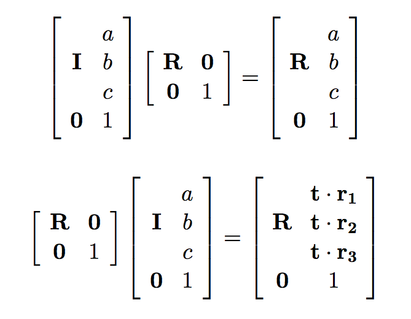

We have learnt about Translation matrix T, Rotation matrices R and Scaling matrices S in our previous experiments. A sequence of these transforms can be represented using a composite matrix, say  

M = RxTRyST

Operations are not commutative but are associative.

Translations are commutative: T1T2 = T2T1

Scaling is commutative: S1S2 = S2S1

Rotations are NOT commutative: R1R2  â  R2R1

Also RT  â  TR. Consider the following matrix representation.

