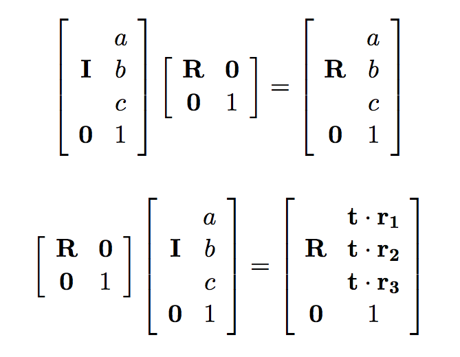
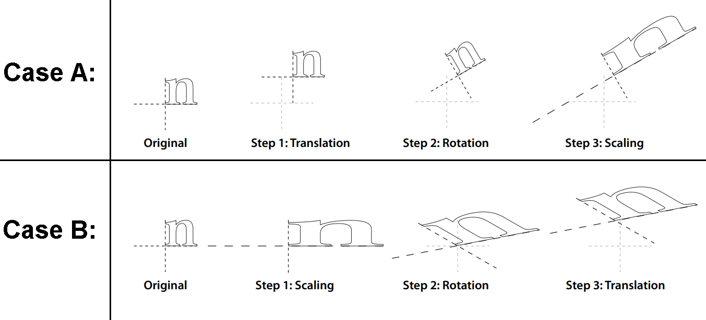

* We have learnt about Translation matrix T, Rotation matrices R and Scaling matrices S in our previous experiments.  
* A sequence of these transforms can be represented using a composite matrix, say  
M = RxTRyST

**NOTE**- All Operations are associative but not commutative.

* Let's define multiple transformations:
  - T1, T2: Two different translation matrices
  - S1, S2: Two different scaling matrices
  - R1, R2: Two different rotation matrices

* Translations are commutative: T1T2 = T2T1
  - This means applying two translations in any order gives the same result
  - Example: Moving right then up is the same as moving up then right

* Scaling is commutative: S1S2 = S2S1
  - This means applying two scaling operations in any order gives the same result
  - Example: Scaling by 2 then 3 is the same as scaling by 3 then 2

* Rotations are NOT commutative: R1R2 !=  R2R1
  - This means the order of rotations matters
  - Example: Rotating around X-axis then Y-axis gives a different result than rotating around Y-axis then X-axis

<!-- Also RT != TR. Consider the following matrix representation. -->

<!--  -->

## Transformation Order: TRS vs SRT

**1. Translation, Rotation, Scaling (TRS):**

When transformations are applied in the order of Translation, Rotation, and Scaling (TRS), the combined transformation matrix  MTRS is computed as:

MTRS = Mscale * Mrotate * Mtranslate

Here,
-  Mtranslate represents the translation matrix,
-  Mrotate represents the rotation matrix,
-  Mscale represents the scaling matrix.

The order of multiplication ensures that:
- Translation is applied first, followed by rotation around the translated point, and then scaling relative to the translated and rotated coordinate system.

**2. Scaling, Rotation, Translation (SRT):**

Conversely, applying transformations in the order of Scaling, Rotation, and Translation (SRT) results in a different transformation matrix:

 MSRT = Mtranslate* Mrotate * Mscale

The multiplication order implies:
- Scaling is applied first, followed by rotation relative to the scaled coordinates, and then translation relative to the scaled and rotated coordinate system.

    
Let's understand through an example

* The image demonstrates how changing the order of three transformations (translation, rotation, and scaling) affects a lowercase letter "n".

    - **Case A:** Performs transformations in the order of translation first, followed by rotation, and finally scaling.
    - **Case B:** Uses a different order: scaling first, followed by rotation, and then translation.  

* These different orders result in two distinctly different final positions and shapes of the letter "n", illustrating that the sequence of transformations significantly influences the outcome.
* This example highlights the importance of transformation order in determining the final appearance and position of objects in graphical applications.

    

 

**Non-Commutative Nature:**
* MTRS and  MSRT are generally not equal due to matrix multiplication rules. This non-commutativity means that the order in which transformations are applied affects the final transformation matrix and consequently the resulting object's position, orientation, and size in 3D space.

**Visual and Functional Differences:**
* Depending on the application, the choice between TRS and SRT can produce different visual effects or functional behaviors. For example, rotating an object before scaling it can change how scaling affects its dimensions relative to its orientation.

### Conclusion
* In computer graphics, the order of applying transformations—translation, rotation, and scaling—depends on user preference and specific needs.

* Understanding the mathematical implications of transformation order  MTRS vs  MSRT is crucial in 3D computer graphics and geometric modeling. This knowledge ensures that designers and developers achieve desired visual outcomes and functional behaviors by strategically ordering translation, rotation, and scaling operations based on specific project requirements and aesthetic goals.

* In the simulation, we will use the order of scaling, rotation, and then translation.

